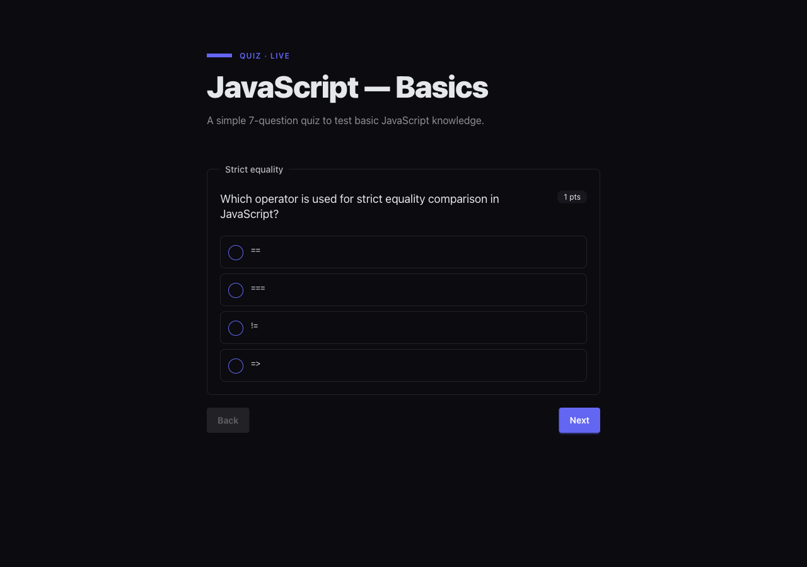

# quiz-mcp

An MCP server that lets an AI model hand off interactive quizzes to a human through a local browser UI. The model registers a quiz via the `start_quiz` tool, the user fills it in at `http://localhost:<port>`, and the model reads back the submitted answers via `get_answers` — all over standard MCP stdio, with no persistent infrastructure required. The HTTP server lazy-starts on the first `start_quiz` call and shuts down automatically once every quiz has been finished and its result consumed.



## Repository structure

| Path | Package / App | Description |
|---|---|---|
| `apps/cli` | `@quiz-mcp/cli` | Published binary (`quiz-mcp`). MCP stdio server, lazy runner lifecycle, `create` scaffolding command. |
| `apps/runner` | `@quiz-mcp/runner` | Standalone CLI that loads a quiz from a file/URL/stdin, serves it in a browser, and writes answers to a file or webhook. |
| `packages/core` | `@quiz-mcp/core` | Domain foundation: Zod schemas, types, grading engine, answer validation. Single source of truth for the quiz format. |
| `packages/runner-api` | `@quiz-mcp/runner-api` | Hono HTTP server and SSR shell for the quiz runtime. REST endpoints, theming, i18n. Not published standalone. |
| `packages/runner-ui` | `@quiz-mcp/runner-ui` | Vite/Hono-JSX client bundle. Hydrates the SSR shell and wires `<quiz-player>` events to the REST API. Assets only, not a runtime import. |
| `packages/web-components` | `@quiz-mcp/web-components` | Framework-agnostic `<quiz-player>` custom element (Svelte 5 + Shadow DOM + DaisyUI 5). |
| `demo/` | — | Sample quiz JSON files. |
| `schema/` | — | Generated JSON Schema for the `Quiz` type (`schema/quiz.schema.json`). |
| `scripts/` | — | Build-time utilities: JSON Schema generation and validation against AJV. |

## Requirements

| Tool | Version |
|---|---|
| Node.js | ≥ 20 |
| pnpm | 10.8.1 (pinned via `packageManager`) |

## Installation

```bash
git clone https://github.com/karerckor/quiz-mcp.git
cd quiz-mcp
pnpm install
```

## Quick start

### Build everything

```bash
pnpm build
```

Turborepo respects the dependency graph (`^build`), so packages are built in the correct order.

### Run the full test suite

```bash
pnpm test
```

### Type-check all packages

```bash
pnpm typecheck
```

### Watch mode (parallel)

```bash
pnpm dev
```

## Usage scenarios

### 1. Register quiz-mcp as an MCP server (Claude Code)

Create or extend `.mcp.json` in your project root:

```json
{
  "mcpServers": {
    "quiz-mcp": {
      "type": "stdio",
      "command": "npx",
      "args": ["-y", "@quiz-mcp/cli", "mcp"]
    }
  }
}
```

For Claude Desktop (`claude_desktop_config.json`) or Cursor (`~/.cursor/mcp.json`), use the same `command`/`args` pair. Once connected, the model gains four tools: `start_quiz`, `get_answers`, `get_quiz_format`, and `stop_runner`.

### 2. Scaffold and run a quiz from the CLI

Create a minimal quiz file, then serve it in a browser:

```bash
# scaffold a new quiz skeleton → ./javascript-basics.quiz.json
npx @quiz-mcp/cli create "JavaScript basics"

# serve it and write answers to a file
npx @quiz-mcp/runner --file ./javascript-basics.quiz.json --output ./answers.json --open
```

The scaffolded file includes a `$schema` pointer so editors can validate and
autocomplete the quiz structure as you fill it in.

`--open` launches the URL in the system browser automatically.

### 3. Try the JavaScript demo quiz without cloning

Point the runner at the raw URL of the bundled demo — no local checkout needed:

```bash
npx @quiz-mcp/runner \
  --url https://raw.githubusercontent.com/karerckor/quiz-mcp/main/demo/js-quiz.json \
  --output ./answers.json \
  --open
```

This loads `demo/js-quiz.json` (a 7-question JavaScript basics quiz) straight from GitHub.

### 4. Serve a quiz from a remote URL with a webhook sink

```bash
npx @quiz-mcp/runner \
  --url https://example.com/quiz.json \
  --on-complete https://example.com/hooks/quiz \
  --output ./answers.json
```

The runner exits with code `0` on success, `1` on load/validation failure, `2` if a sink failed after the quiz completed.

## Quiz schema

The `Quiz` format is defined in `packages/core` as a Zod schema and exported as a JSON Schema to `schema/quiz.schema.json`.

Top-level shape:

```json
{
  "id": "my-quiz-1",
  "title": "Quiz title",
  "description": "Optional description",
  "questions": [ /* Question[] */ ]
}
```

Supported question types (`_kind`):

`single_choice`, `multiple_choice`, `short_text`, `long_text`, `dropdown`, `fill_gaps`, `match`, `scale`, `sorting`, `upload`

Regenerate or verify the schema:

```bash
pnpm schema:gen    # writes schema/quiz.schema.json
pnpm schema:check  # validates the generated schema with AJV
```

The schema is also available at the canonical URL embedded in the file:
`https://raw.githubusercontent.com/karerckor/quiz-mcp/main/schema/quiz.schema.json`

## Package READMEs

- [`apps/cli/README.md`](apps/cli/README.md) — MCP tools, lifecycle behaviour, CLI commands
- [`apps/runner/README.md`](apps/runner/README.md) — standalone runner CLI flags, exit codes, architecture
- [`packages/core/README.md`](packages/core/README.md) — domain schemas, grading API, validation, adding question types
- [`packages/runner-api/README.md`](packages/runner-api/README.md) — REST endpoints, SSR server options, `QuizService` interface, theming
- [`packages/runner-ui/README.md`](packages/runner-ui/README.md) — client bundle internals, Vite manifest, custom deployments
- [`packages/web-components/README.md`](packages/web-components/README.md) — `<quiz-player>` element API, events, theming, framework integration

